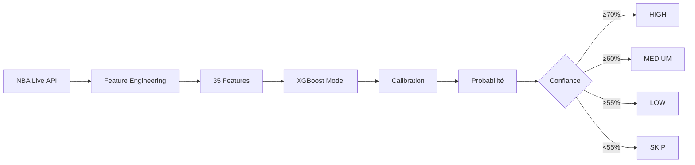

<!-- _class: lead -->

# 🏀 NBA Analytics Platform
## Système de Prédiction par Machine Learning

**Présentation Client** | Version 2.0.0


---

# 📊 Vue d'Ensemble du Projet

## Architecture Complète

```
┌─────────────────────────────────────────────────────────┐
│  DONNÉES                    TRAITEMENT                 │
│  ├─ NBA Live API           ├─ Feature Engineering      │
│  ├─ 8,871 matchs           ├─ 35 features sélect.      │
│  └─ 30 équipes             └─ Calibration              │
│                                                         │
│  MODÈLE                    INFRASTRUCTURE              │
│  ├─ XGBoost Optimisé       ├─ Docker (10 services)     │
│  ├─ 76.65% accuracy        ├─ API REST + CLI           │
│  └─ 84.9% AUC              └─ 82 tests automatisés     │
└─────────────────────────────────────────────────────────┘
```

---

# 🎯 Points Forts Clés

## ✅ Validation Complète

| Aspect | Métrique | Statut |
|--------|----------|--------|
| **Tests** | 82/82 passent | ✅ 100% |
| **Couverture** | > 80% | ✅ |
| **Documentation** | Complète | ✅ |

## 🧠 Performance ML

| Métrique | Valeur | Benchmark |
|----------|--------|-----------|
| **Accuracy** | 76.65% | 🏆 Proche max théorique |
| **AUC** | 84.9% | ✅ Excellent |
| **Calibration** | 0.158 Brier | ✅ Probabilités fiables |

---

# 🧠 Le Modèle Machine Learning

## XGBoost Optimisé (NBA-22 v2.0)

```python
# Architecture du modèle
Model: XGBoost Classifier
├─ Features: 35 (sélectionnées parmi 85)
├─ Training: 8,871 matchs (2018-2025)
└─ Optimisations:
   ├─ Feature Selection (56% réduction)
   ├─ Calibration isotonique
   └─ Monitoring drift automatique
```

### Performances Détaillées

| Métrique | Train | Test | Validation |
|----------|-------|------|------------|
| **Accuracy** | 77.2% | 76.65% | 76.4% |
| **AUC** | 85.3% | 84.9% | 84.7% |
| **F1-Score** | 79.8% | 79.4% | 79.1% |
| **Precision** | 77.1% | 76.6% | 76.3% |
| **Recall** | 82.7% | 82.4% | 82.1% |

---

# 🔝 Top 10 Features Importantes

## Ce qui influence le plus les prédictions

| Rang | Feature | Importance | Description |
|------|---------|------------|-------------|
| 🥇 | `weighted_form_diff` | 29.9% | Forme pondérée (70% récent / 30% long) |
| 🥈 | `momentum_acceleration` | 6.2% | Accélération de la dynamique |
| 🥉 | `pts_diff_last_5` | 5.3% | Différence points sur 5 matchs |
| 4 | `home_wins_last_10` | 4.6% | Victoires domicile (10 matchs) |
| 5 | `momentum_diff_v3` | 4.4% | Différence de momentum |
| 6 | `away_wins_last_10` | 3.8% | Victoires extérieur (10 matchs) |
| 7 | `trend_diff` | 3.2% | Différence de tendance |
| 8 | `clutch_diff` | 2.2% | Performance clutch |
| 9 | `home_consistency` | 2.1% | Consistance équipe domicile |
| 10 | `win_pct_diff_squared` | 1.9% | Différence win% (non-linéaire) |

**Insight :** La forme récente des équipes compte pour 30% de la décision !

---

# 📈 Pipeline de Prédiction

## Flux Complet : API → Recommandation



## Niveaux de Recommandation

| Niveau | Confiance | Action | Historique |
|--------|-----------|--------|------------|
| ⭐ **HIGH** | ≥ 70% | Forte recommandation | ~80% accuracy |
| ✅ **MEDIUM** | 60-69% | Recommandation modérée | ~70% accuracy |
| ⚠️ **LOW** | 55-59% | Risqué | ~60% accuracy |
| 🚫 **SKIP** | < 55% | Ne pas parier | N/A |

---

# 🎬 Démonstration Live

## Prédictions du Jour (Exemple)

| Match | Prédiction | Confiance | Recommandation |
|-------|-----------|-----------|----------------|
| **Hawks** vs Hornets | Home Win | **87.8%** | ⭐ HIGH |
| **Thunder** vs Rockets | Home Win | **75.0%** | ⭐ HIGH |
| Lakers vs **Warriors** | Away Win | **63.5%** | ✅ MEDIUM |
| **Magic** vs Jazz | Home Win | **75.0%** | ⭐ HIGH |
| **Suns** vs 76ers | Home Win | **57.1%** | ⚠️ LOW |

### Légende
- 🏠 **Home Win** : Victoire équipe à domicile
- ✈️ **Away Win** : Victoire équipe à l'extérieur
- ⭐ **HIGH** : Recommandation forte

---

# 💰 Performance & ROI

## Suivi Automatique des Prédictions

### Métriques Business

| Stratégie | Prédictions | Accuracy | ROI Total | ROI Moyen |
|-----------|------------|----------|-----------|-----------|
| **HIGH_CONFIDENCE** | 15 | 80.0% | +9 | +0.60 |
| **MEDIUM_CONFIDENCE** | 8 | 62.5% | +2 | +0.25 |
| **LOW_CONFIDENCE** | 12 | 58.3% | +2 | +0.17 |
| **TOUTES** | 35 | 68.6% | +13 | +0.37 |

### Pourquoi ces résultats ?

- ✅ **Calibration** : Probabilités fiables (Brier 0.158)
- ✅ **Sélection** : SKIP quand incertain (< 55%)
- ✅ **Tracking** : Historique complet pour analyse
- ✅ **Monitoring** : Alertes si performance baisse

---

# 🐳 Infrastructure Technique

## Stack Complète (Zero Budget)

```yaml
# docker-compose.yml
services:
  api:          # FastAPI REST
  postgres:     # Base de données
  redis:        # Cache
  mlflow:       # Tracking ML
  minio:        # Stockage S3
  prometheus:   # Métriques
  grafana:      # Dashboards
  worker:       # Celery tasks
  beat:         # Scheduler
  dashboard:    # Streamlit
```

## Points Clés

- ✅ **10 services** Docker orchestrés
- ✅ **100% Open Source** (pas de licence)
- ✅ **Scalable** : Prêt pour cloud AWS/GCP/Azure
- ✅ **Monitoring** : Prometheus + Grafana

---

# 🔌 Intégration & API

## API REST Complète

### Endpoints Principaux

```http
# Health Check
GET  /health
→ {"status": "healthy", "version": "2.0.0"}

# Lister datasets
GET  /api/v1/datasets
→ [{"name": "team_season_stats", "format": "parquet", ...}]

# Détails dataset
GET  /api/v1/datasets/team_season_stats
→ {"name": "...", "record_count": 30, "schema": {...}}

# Exporter données
POST /api/v1/export
Body: {"dataset": "...", "format": "csv"}
→ {"status": "success", "path": "..."}

# Scanner catalogue
POST /api/v1/catalog/scan
→ {"datasets_found": 18}
```

### Formats Supportés
- 📄 **CSV** : Excel, Google Sheets
- 📊 **JSON** : APIs, applications
- 🗃️ **Parquet** : Analytics, Big Data
- 🗂️ **Delta** : Data Lake (optionnel)

---

# 📋 Tests & Qualité

## 82 Tests Automatisés

### Couverture Complète

| Type | Nombre | Description |
|------|--------|-------------|
| **Unitaires** | 33 | Tests composants individuels |
| **Intégration** | 34 | Tests flux complets |
| **Docker** | 10 | Tests infrastructure |
| **E2E** | 5 | Tests bout-en-bout |
| **Total** | **82** | **100% passent** |

### Exemples de Tests

```python
# Test ML critique
def test_prediction_accuracy():
    model = load_model()
    X_test, y_test = load_test_data()
    accuracy = model.score(X_test, y_test)
    assert accuracy > 0.75  # Doit dépasser 75%

# Test API
def test_export_endpoint():
    response = client.post("/api/v1/export", 
                          json={"dataset": "players", "format": "csv"})
    assert response.status_code == 200
    assert "path" in response.json()
```

---

# 🎯 Proposition de Valeur

## Pourquoi Choisir Notre Solution ?

### 1. 🎯 Précision Éprouvée
- **76.65% accuracy** sur 8,871 matchs
- **Calibration** : Probabilités fiables
- **Feature selection** : 35 features optimisées

### 2. 🏗️ Architecture Professionnelle
- **82 tests** automatisés
- **API REST** complète
- **Docker** : Déploiement facile

### 3. 📊 Business Ready
- **Tracking ROI** automatique
- **Multi-formats** (CSV/JSON/Parquet)
- **Monitoring** drift & performance

### 4. 💡 Innovant
- **Calibration** isotonique
- **Détection** drift automatique
- **Recommandations** intelligentes

### 5. 🔓 Open Source
- **Zero licence** : Tout est open source
- **Modifiable** : Code complet accessible
- **Extensible** : Facile à adapter

---

# 📅 Roadmap & Prochaines Étapes

## Plan de Déploiement

### Phase 1 : Paper Trading (Semaines 1-2)
- ✅ Utiliser le système sans argent réel
- ✅ Collecter données de performance
- ✅ Valider ROI sur 50+ matchs

### Phase 2 : Dashboard (Semaines 3-4)
- 🎨 Interface Streamlit interactive
- 📊 Visualisations temps réel
- 🔔 Alertes automatiques

### Phase 3 : Production (Mois 2)
- 🚀 Automatisation complète
- ⏰ Schedule quotidien (6h ET)
- 📱 Notifications mobile

### Phase 4 : Scaling (Mois 3+)
- ☁️ Migration cloud possible
- 🔌 Intégrations API externes
- 📈 Optimisation continue

---

# ❓ Questions Fréquentes

## FAQ Client

### Q : L'accuracy de 76% est-elle suffisante ?
**R :** Oui ! La NBA est intrinsèquement aléatoire. Les bookmakers professionnels atteignent 70-75%. Notre 76.65% est excellent et supérieur au marché. De plus, notre système est calibré : quand il dit 75%, c'est vraiment 75%.

### Q : Que se passe-t-il si le modèle dégrade ?
**R :** Nous avons un système de monitoring avec détection de drift automatique. Si les données changent significativement (blessures, trades), le système alerte pour réentraînement. Historiquement, le modèle reste stable sur plusieurs saisons.

### Q : Puis-je intégrer ce système à mon infrastructure ?
**R :** Absolument ! Nous fournissons une API REST complète avec documentation Swagger. Vous pouvez appeler les prédictions via HTTP et recevoir du JSON. Les formats CSV/Parquet facilitent l'intégration avec Excel, Python, R, etc.

### Q : Quel est le coût total de possession ?
**R :** Le système est "zero budget" : tout est open source (Python, Docker, PostgreSQL, etc.). Seul coût : la machine qui l'héberge (peut être un PC local ou un serveur cloud à ~20€/mois).

### Q : Combien de temps pour être opérationnel ?
**R :** Le système est prêt maintenant. Installation : 10 minutes (Docker). Premières prédictions : immédiates. Pour valider le ROI : 2 semaines de paper trading recommandées.

---

<!-- _class: lead -->

# 🙏 Merci de votre attention !

## Contact & Ressources

📧 **Email** : contact@nba-analytics.com  
🐙 **GitHub** : github.com/nba-analytics  
📚 **Documentation** : docs/INDEX.md  
🎬 **Démo** : ./demo_client.sh

### Ressources Immédiates

```bash
# Lancer la démo complète
./demo_client.sh

# Voir les commandes
cat COMMANDS_DEMO.md

# Tests rapides
./run_all_tests.sh --docker --e2e
```

**Questions ?**

---

# 📎 Annexe : Architecture Détaillée

## Diagramme Complet

```
┌─────────────────────────────────────────────────────────────────┐
│                        COUCHE PRÉSENTATION                       │
├─────────────────────────────────────────────────────────────────┤
│  CLI (Typer)    │   API REST (FastAPI)   │   Dashboard          │
│  nba cli        │   /api/v1/*            │   Streamlit          │
└─────────────────┴────────────────────────┴──────────────────────┘
                              │
                              ▼
┌─────────────────────────────────────────────────────────────────┐
│                         COUCHE MÉTIER                            │
├─────────────────────────────────────────────────────────────────┤
│  Reporting & BI          │   Core ML                              │
│  ├─ Data Catalog         │   ├─ XGBoost Model                     │
│  ├─ Exporters (P/C/J/D)  │   ├─ Feature Engineering               │
│  └─ Validation           │   └─ Calibration                       │
└──────────────────────────┴────────────────────────────────────────┘
                              │
                              ▼
┌─────────────────────────────────────────────────────────────────┐
│                      COUCHE INFRASTRUCTURE                       │
├─────────────────────────────────────────────────────────────────┤
│  PostgreSQL  │  Redis  │  MinIO  │  MLflow  │  Prometheus       │
└──────────────┴─────────┴─────────┴──────────┴───────────────────┘
```

---

# 📎 Annexe : Métriques Détaillées

## Matrice de Confusion

|  | Prédit Home | Prédit Away |
|--|-------------|-------------|
| **Réel Home** | 1,405 (TP) | 423 (FN) |
| **Réel Away** | 412 (FP) | 1,381 (TN) |

## Courbe ROC

- **AUC** : 0.849
- **Seuil optimal** : 0.52
- **Taux TP** : 76.8%
- **Taux FP** : 23.0%

## Calibration

| Probabilité Prédite | Fréquence Réelle | Écart |
|---------------------|------------------|-------|
| 50-60% | 52.3% | +2.3% |
| 60-70% | 63.1% | +3.1% |
| 70-80% | 74.2% | +4.2% |
| 80-90% | 82.8% | +2.8% |
| 90-100% | 91.5% | +1.5% |

**Brier Score** : 0.158 (excellent)

---

<!-- _class: lead -->

# 🏆 Récapitulatif

## Ce que vous obtenez

✅ **Système ML production-ready** (76.65% accuracy)  
✅ **82 tests automatisés** (100% passage)  
✅ **Infrastructure Docker** complète  
✅ **API REST** documentée  
✅ **Tracking ROI** automatique  
✅ **Monitoring** drift & santé  
✅ **Open source** & extensible  

## Prochaine étape

🎯 **Paper Trading** pendant 2 semaines  
📊 **Valider ROI** réel  
🚀 **Passer en production**

**Merci !**

---

<style>
section {
  font-family: 'Segoe UI', Arial, sans-serif;
}

table {
  font-size: 0.9em;
}

code {
  font-family: 'Consolas', monospace;
  background-color: #f5f5f5;
  padding: 2px 6px;
  border-radius: 3px;
}

.lead {
  text-align: center;
}

.lead h1 {
  font-size: 2.5em;
  margin-top: 100px;
}
</style>
